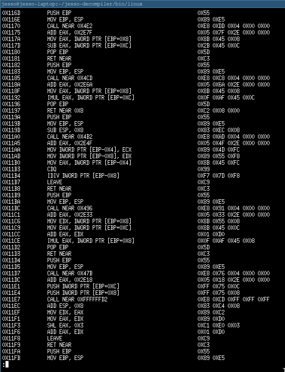

# Jesso Decompiler: A C decompiler for Windows and Linux
The Jesso Decompiler is a tool that will generate readable C code from a compiled binary. It can either read from a file, or parse a given string
of bytes. The command line interface for Linux will handle reading from an ELF binary, and the Windows graphical user interface will handle reading a
portable executable file. All bytes must be in x86-64 machine code, and when generating assembly output, it will be in Intel style syntax. The GUI for Windows
is made using wxWidgets (https://wxwidgets.org). 

# Installation
If you do not want to compile it yourself, there are precompiled binaries already in bin. "JessoDecompiler.exe" is the GUI application for windows, and "jdc" is 
the CLI for linux.

Assuming you have git, gcc, and make installed, you can compile the Jesso Decompiler yourself on Linux.
Just clone the git repository, cd into it, and then run "make jdc". This will compile the CLI and place it in bin/linux
```bash

git clone https://github.com/Jesso4906/jesso-decompiler.git
cd jesso-decompiler
make jdc

```

# Usage
If you run the CLI with the -h or --help flag, you will get a list of flags that can be used with the Jesso Decompiler.
```

-da or --disassemble: This is used if you only want to disassemble machine code and not decompile. By default, a string of bytes is expected as the final argument.
    -f: this flag will disassemble a file as input rather than a string of bytes. This expects the path to be passed as the final argument.
    -x86: this will disassemble the input assuming that it is x86 machine code rather than x64.
    -a: this will show the address of each instruction in the assembly output.
    -b: this will show the bytes of each instruction in the assembly output.
    -ob: this will only show the bytes of each instruction and not the assembly.

```

